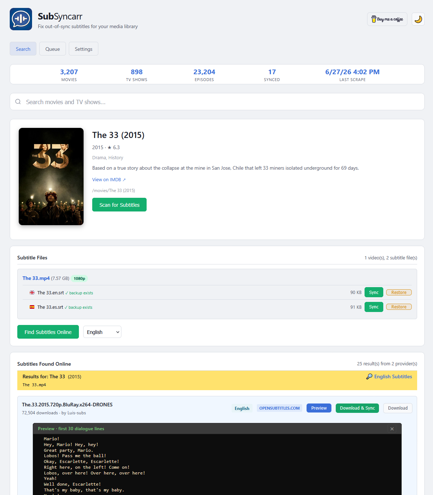
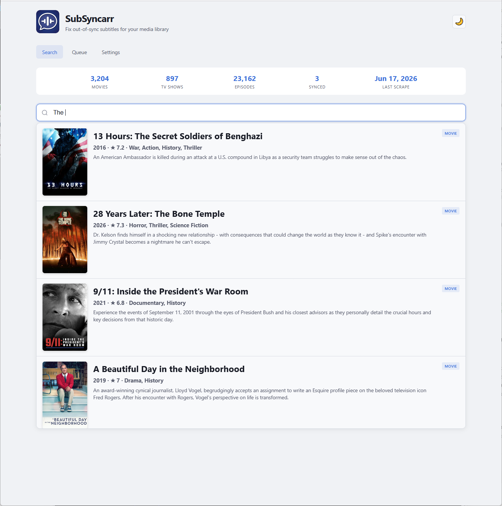
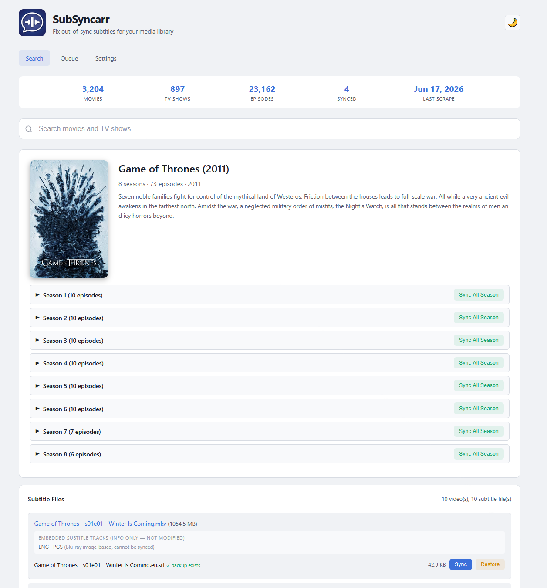
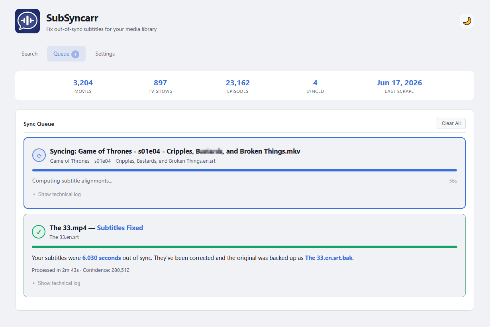
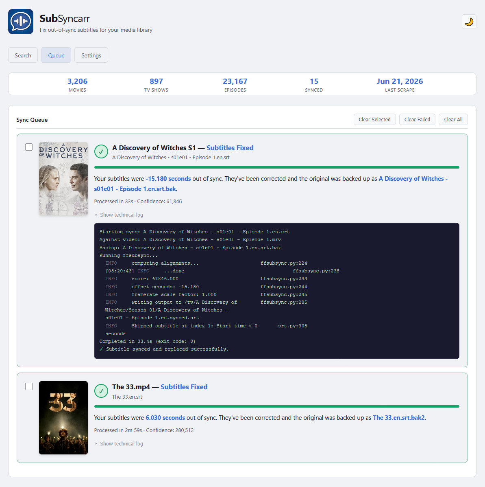
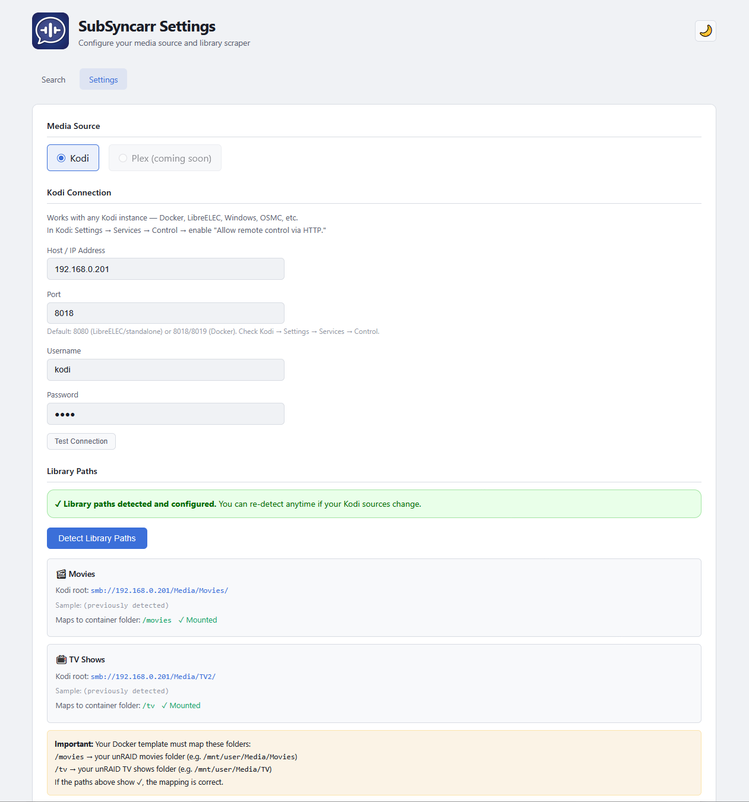

# SubSyncarr

<p align="center">
  
</p>

<p align="center">
  <strong>Fix out-of-sync subtitles from your couch.</strong><br>
  Search your Kodi library with poster art, scan for subtitle files, and fix timing with one click.
</p>

<p align="center">
  <a href="https://hub.docker.com/r/hernandito/subsyncarr"></a>
  <a href="https://github.com/hernandito/SubSyncarr/releases"></a>
</p>

---

## What It Does

SubSyncarr connects to your **Kodi** media library, scrapes your movies and TV shows, and gives you a clean web interface to fix subtitle timing — all from your phone, tablet, or browser. 

Have you ever sat down to watch a movie or show and find that the subs are out of sync? You hunt for other subs and struggle to find something that works? With this, in about 3 minutes, you can correct the subtitle synch; **without leaving the couch!**

It uses [ffsubsync](https://github.com/smacke/ffsubsync) under the hood, which analyzes the audio track of your video and aligns the subtitle timing to match speech patterns. It works with **any language combination** — English audio with English subs, Spanish audio with English subs, or any other pairing.

### Key Features

- **Search with poster art** — type a movie or TV show name and see results with posters, ratings, genres, and plot summaries
- **Smart folder scanning** — detects external subtitle files (.srt, .ass, .ssa, .sub, .vtt) and shows embedded tracks for reference
- **One-click sync** — ffsubsync analyzes the audio and corrects subtitle timing automatically
- **Automatic backups** — every subtitle is backed up before modification, with one-click restore
- **Batch TV season sync** — fix an entire season's subtitles in one click
- **Live sync queue** — animated progress bar, elapsed timer, and human-readable results
- **Auto-detection** — automatically detects your Kodi library paths during setup
- **Light/dark theme** — toggle between light and dark modes
- **Couch-friendly** — large posters, big tap targets, designed for phone and tablet use

---

## Screenshots

### Search Movies


### Search & Select a Movie


### Search TV Shows


### Sync In Progress


### Sync Complete


### Settings — Auto-Detection Wizard


---

## Installation

### unRAID (Community Applications)

Search for **SubSyncarr** in Community Applications and click Install. Configure:

| Field | Value |
|-------|-------|
| **Movies Folder** | Your unRAID movies path (e.g. `/mnt/user/Media/Movies`) |
| **TV Shows Folder** | Your unRAID TV shows path (e.g. `/mnt/user/Media/TV`) |
| **Config** | `/mnt/user/appdata/subsyncarr` |
| **WebUI Port** | `5889` |

### Docker Run

```bash
docker run -d \
  --name subsyncarr \
  -p 5889:5889 \
  -v /path/to/appdata/subsyncarr:/config \
  -v /path/to/movies:/movies \
  -v /path/to/tv:/tv \
  -e TZ=America/New_York \
  -e SCRAPE_INTERVAL=12 \
  hernandito/subsyncarr:latest
```

### Docker Compose

```yaml
services:
  subsyncarr:
    image: hernandito/subsyncarr:latest
    container_name: subsyncarr
    ports:
      - 5889:5889
    volumes:
      - /path/to/appdata/subsyncarr:/config
      - /path/to/movies:/movies
      - /path/to/tv:/tv
    environment:
      - TZ=America/New_York
      - SCRAPE_INTERVAL=12
    restart: unless-stopped
```

---

## First-Time Setup

1. Open `http://YOUR-IP:5889` — you'll be redirected to Settings
2. Enter your **Kodi connection** details (host, port, username, password)
3. Click **Test Connection** to verify
4. Click **Detect Library Paths** — SubSyncarr queries Kodi and auto-detects where your media lives
5. Verify both Movies and TV show green ✓ checkmarks (confirms Docker volumes are mapped correctly)
6. Click **Save Settings**
7. Click **Scrape Library Now** — this takes 2-3 minutes for large libraries
8. Go to the **Search** page and start fixing subtitles!

---

## How It Works

1. **Search** — type a movie or TV show name
2. **Scan** — click the result, then "Scan for Subtitles" to see what files exist in the folder
3. **Sync** — click the Sync button next to any external subtitle file
4. **Wait** — ffsubsync extracts the audio, analyzes speech patterns, and aligns the subtitle timing (1-3 minutes for movies, 30-60 seconds for TV episodes)
5. **Done** — the corrected subtitle replaces the original, with a backup created automatically

### What ffsubsync does under the hood

It extracts the audio track, creates a speech-vs-silence fingerprint, does the same with the subtitle timing, and uses FFT to find the best alignment. It handles:

- **Constant offset** — subtitles are X seconds early/late throughout
- **Frame-rate drift** — subtitles start fine but gradually desync
- **Segment shifts** — different cuts of the same film

It does NOT transcribe audio — it's language-agnostic and works with any language combination.

### What it does NOT touch

- **Embedded subtitle tracks** are never modified — they're displayed for reference only
- **Video files** are never modified
- Only **external sidecar subtitle files** (.srt, .ass, .ssa, .sub, .vtt) are processed

---

## Configuration

| Environment Variable | Default | Description |
|---------------------|---------|-------------|
| `TZ` | `America/New_York` | Container timezone |
| `SCRAPE_INTERVAL` | `12` | Auto-scrape interval in hours (6, 12, or 24) |
| `PUID` | `99` | User ID (99 = nobody on unRAID) |
| `PGID` | `100` | Group ID (100 = users on unRAID) |

| Volume | Purpose |
|--------|---------|
| `/config` | Persistent database and settings |
| `/movies` | Your movies folder |
| `/tv` | Your TV shows folder |

---

## Roadmap

- [x] Kodi library scraping (movies + TV episodes)
- [x] Poster-rich search with plot summaries
- [x] One-click subtitle sync with ffsubsync
- [x] Batch TV season sync
- [x] Backup and restore system
- [x] Auto-detection of Kodi library paths
- [x] Light/dark theme
- [ ] 🔜 **Plex** library support
- [ ] 🔜 **Jellyfin** library support
- [ ] 🔜 **Emby** library support
- [ ] 🔜 **Subtitle download** — search and download subtitles directly from OpenSubtitles, SubDL, Podnapisi, and other providers
- [ ] 🔜 **Download + sync in one step** — find, download, and fix subtitles without leaving the couch

---

## Support

If you find SubSyncarr useful, consider starring the repo ⭐

For bugs and feature requests, please [open an issue](https://github.com/hernandito/SubSyncarr/issues).

---

## License

MIT License
